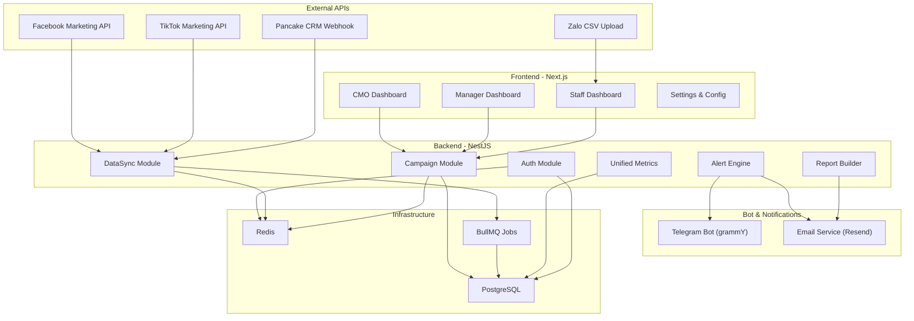
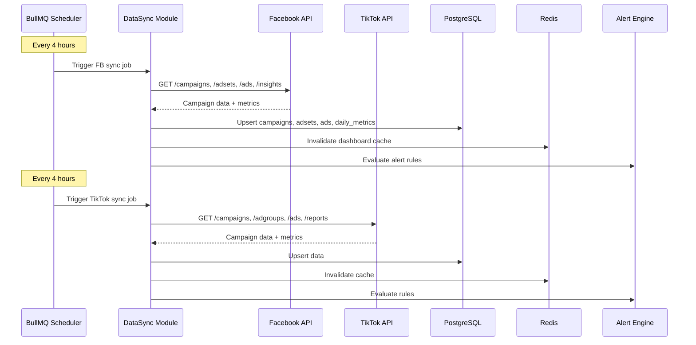
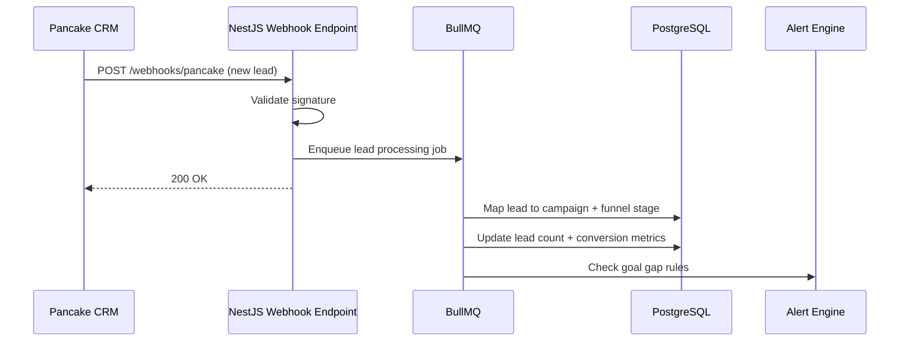
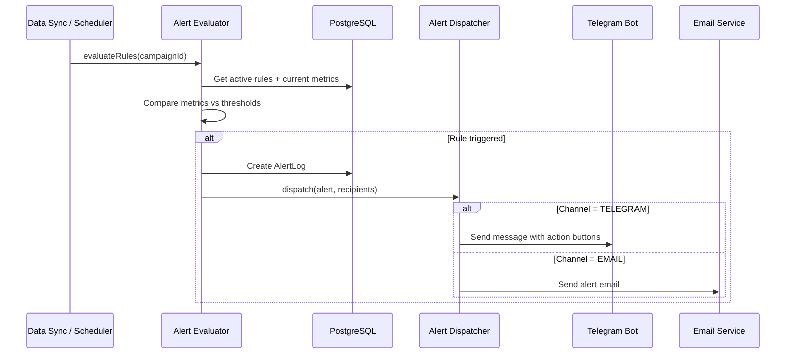

# Architecture Decision Document — Marketing Hub

**Tác giả:** Lucas
**Ngày:** 2026-02-24
**Phiên bản:** 1.0
**Source PRD:** `projects/S Group/marketing/prd.md`

---

## 1. Project Context & Constraints

### 1.1 Tóm tắt sản phẩm

Internal SaaS quản lý dữ liệu marketing đa kênh (Facebook, Zalo, TikTok, CRM) cho team 10 người. Toàn bộ PRD chi tiết tại [prd.md](file:///Users/lucasbraci/Desktop/Antigravity/projects/S%20Group/marketing/prd.md).

### 1.2 Architectural Drivers

| Driver | Impact | Priority |
|--------|--------|----------|
| **Auto-sync data từ 4 nguồn** | Cần connectors + queue system | P0 |
| **Role-based views** (CMO/Manager/Staff) | Frontend routing + auth middleware | P0 |
| **Telegram Bot bi-directional** | Separate bot service + shared DB | P0 |
| **Unified funnel mapping** | Metrics normalization layer | P0 |
| **Progressive delivery** (4 phases) | Modular, decoupled architecture | P0 |
| **10 users, ~20 campaigns** | Không cần horizontal scaling | Context |

### 1.3 Constraints

| Constraint | Decision |
|------------|----------|
| **Team size** | 10 users → single-server sufficient, no need for microservices |
| **Budget** | Internal tool → cost-optimized hosting (VPS hoặc Vercel + Railway) |
| **API limits** | FB/TikTok rate limits → tiered sync schedule, not real-time |
| **Zalo API** | Limited analytics API → CSV upload fallback required |
| **Timeline** | Phase 1 trong 4 tuần → modular monolith, không microservice |

---

## 2. Architecture Decision Records (ADRs)

### ADR-001: Monolith vs Microservices

**Decision:** Modular Monolith (NestJS)

| Option | Pros | Cons |
|--------|------|------|
| **Modular Monolith** ✅ | Ship nhanh, 1 deploy, dễ debug, đủ cho 10 users | Coupling risk nếu không discipline |
| Microservices | Independent scaling, team isolation | Over-engineering cho 10 users, complexity overhead |
| Serverless | Zero ops, auto-scale | Cold starts, vendor lock-in, khó debug |

**Rationale:** 10 users, 20 campaigns → modular monolith đủ cho 5+ năm. NestJS modules cung cấp logical separation mà không phải physical separation. Nếu scale lên 100+ users, tách module thành service riêng chỉ cần move folder + add API calls.

---

### ADR-002: Frontend Framework

**Decision:** Next.js 15 (App Router) + shadcn/ui

| Option | Pros | Cons |
|--------|------|------|
| **Next.js + shadcn/ui** ✅ | Server Components, role-based layouts, SEO, fullstack | Learning curve App Router |
| Vite + React | Simpler, faster builds | No SSR, need separate API |
| Vue/Nuxt | Simpler template syntax | Smaller ecosystem cho enterprise UI |

**Rationale:** Next.js App Router cho phép `layout.tsx` per role (CMO/Manager/Staff) với Server Components cho data fetching. shadcn/ui cung cấp beautiful components mà vẫn customizable. Server Actions cho mutation forms.

---

### ADR-003: Database

**Decision:** PostgreSQL + Prisma ORM

| Option | Pros | Cons |
|--------|------|------|
| **PostgreSQL + Prisma** ✅ | Relational data (Campaign → AdSet → Ad), typed queries, migrations | Prisma có overhead nhỏ |
| MongoDB | Flexible schema | Hard to enforce relations, aggregation phức tạp |
| Supabase | Hosted Postgres + Auth + Realtime | Vendor lock-in, cost |

**Rationale:** Marketing data is inherently relational (Campaign has AdSets, AdSets have Ads, Ads have Metrics). Prisma provides type-safe queries + auto-migration. PostgreSQL JSON columns cho flexible metadata (ad creative details, CRM custom fields).

---

### ADR-004: Job Queue & Background Processing

**Decision:** BullMQ (Redis-based)

| Option | Pros | Cons |
|--------|------|------|
| **BullMQ** ✅ | Proven, schedulable, retries, dashboard (Bull Board) | Need Redis |
| Agenda.js | MongoDB-based | Less community, fewer features |
| pg-boss | PostgreSQL-based, no Redis needed | Less ecosystem |
| node-cron | Simple | No retry, no queue, no monitoring |

**Rationale:** Cần queue cho 5 job types: (1) API sync schedules, (2) report generation, (3) alert processing, (4) webhook processing, (5) email sending. BullMQ handles all with retry, scheduling, and monitoring via Bull Board.

---

### ADR-005: Telegram Bot Framework

**Decision:** grammY

| Option | Pros | Cons |
|--------|------|------|
| **grammY** ✅ | TypeScript-first, plugin ecosystem, modern API | Newer than alternatives |
| node-telegram-bot-api | Most popular | No TypeScript, callback-based |
| Telegraf | Popular, middleware-based | Less maintained recently |

**Rationale:** grammY is TypeScript-native, supports conversations (multi-step commands), inline queries, and has a clean plugin architecture for keyboard menus. Perfect cho slash commands + inline responses.

---

### ADR-006: Authentication

**Decision:** Better Auth

| Option | Pros | Cons |
|--------|------|------|
| **Better Auth** ✅ | Full-featured, role-based, session management | Newer library |
| NextAuth.js | Popular, many providers | Session-only, limited RBAC |
| Clerk | Hosted, beautiful UI | Cost, external dependency |
| Custom JWT | Full control | Security risk, maintenance burden |

**Rationale:** Better Auth provides email/password auth + role-based access control out of the box. 4 roles (CMO, HEAD, MANAGER, STAFF) can be enforced at middleware level. Session-based auth is simpler than JWT for internal tools.

---

### ADR-007: Email Service

**Decision:** Resend

| Option | Pros | Cons |
|--------|------|------|
| **Resend** ✅ | Developer-friendly, React Email templates | Newer |
| SendGrid | Proven enterprise | Complex setup |
| Nodemailer + SMTP | Free | No templates, deliverability issues |

**Rationale:** Resend + React Email cho phép viết email templates bằng JSX — dễ maintain weekly PDF reports. Free tier đủ cho internal tool (10 users × 4 emails/tuần = 160 emails/tháng).

---

### ADR-008: Deployment Strategy

**Decision:** Docker + VPS (1 server)

| Option | Pros | Cons |
|--------|------|------|
| **Docker + VPS** ✅ | Cheap ($10-20/mo), full control, predictable cost | Need manage server |
| Vercel + Railway | Zero-ops | Cost scales with usage, vendor split |
| AWS ECS/Fargate | Enterprise-grade | Over-engineered, cost |

**Rationale:** Internal tool cho 10 users → 1 VPS (4GB RAM, 2 CPU) chạy Docker Compose đủ thoải mái. Stack: Next.js + NestJS + PostgreSQL + Redis + Telegram Bot — tất cả trên 1 server. Cost < $20/tháng.

---

## 3. System Architecture

### 3.1 High-Level Architecture



### 3.2 Module Architecture

```
marketing-hub/
├── apps/
│   ├── web/                          # Next.js Frontend
│   │   ├── app/
│   │   │   ├── (auth)/               # Auth pages (login)
│   │   │   ├── (dashboard)/          # Authenticated area
│   │   │   │   ├── layout.tsx        # Role-based layout switcher
│   │   │   │   ├── cmo/              # CMO views
│   │   │   │   │   ├── page.tsx      # Executive KPI dashboard
│   │   │   │   │   └── reports/      # Deep-dive reports
│   │   │   │   ├── manager/          # Manager views
│   │   │   │   │   ├── page.tsx      # Campaign health overview
│   │   │   │   │   ├── campaigns/    # Campaign management
│   │   │   │   │   └── goals/        # Goal setting & tracking
│   │   │   │   └── staff/            # Staff views
│   │   │   │       ├── page.tsx      # Task queue
│   │   │   │       ├── data-entry/   # Smart input forms
│   │   │   │       └── verify/       # Data verification
│   │   │   └── settings/             # User preferences, alerts
│   │   ├── components/
│   │   │   ├── dashboard/            # Dashboard widgets
│   │   │   ├── campaigns/            # Campaign cards, tables
│   │   │   ├── charts/               # Chart components
│   │   │   └── ui/                   # shadcn/ui components
│   │   └── lib/
│   │       ├── api.ts                # API client
│   │       └── auth.ts               # Auth utilities
│   │
│   └── api/                          # NestJS Backend
│       ├── src/
│       │   ├── modules/
│       │   │   ├── auth/             # Authentication + RBAC
│       │   │   │   ├── auth.module.ts
│       │   │   │   ├── auth.guard.ts
│       │   │   │   ├── roles.decorator.ts
│       │   │   │   └── roles.guard.ts
│       │   │   ├── campaigns/        # Campaign CRUD + Goals
│       │   │   │   ├── campaigns.module.ts
│       │   │   │   ├── campaigns.service.ts
│       │   │   │   ├── campaigns.controller.ts
│       │   │   │   ├── goals.service.ts
│       │   │   │   └── budget.service.ts
│       │   │   ├── data-sync/        # External API connectors
│       │   │   │   ├── data-sync.module.ts
│       │   │   │   ├── connectors/
│       │   │   │   │   ├── facebook.connector.ts
│       │   │   │   │   ├── tiktok.connector.ts
│       │   │   │   │   └── pancake.connector.ts
│       │   │   │   ├── sync.scheduler.ts
│       │   │   │   └── csv-import.service.ts
│       │   │   ├── metrics/          # Unified funnel + normalization
│       │   │   │   ├── metrics.module.ts
│       │   │   │   ├── funnel.service.ts
│       │   │   │   └── normalization.service.ts
│       │   │   ├── alerts/           # Alert engine
│       │   │   │   ├── alerts.module.ts
│       │   │   │   ├── alert-rules.service.ts
│       │   │   │   ├── alert-evaluator.service.ts
│       │   │   │   └── alert-dispatcher.service.ts
│       │   │   ├── reports/          # Report builder
│       │   │   │   ├── reports.module.ts
│       │   │   │   ├── daily-digest.service.ts
│       │   │   │   ├── weekly-report.service.ts
│       │   │   │   └── pdf-generator.service.ts
│       │   │   ├── telegram/         # Telegram bot
│       │   │   │   ├── telegram.module.ts
│       │   │   │   ├── bot.service.ts
│       │   │   │   ├── commands/
│       │   │   │   │   ├── report.command.ts
│       │   │   │   │   ├── compare.command.ts
│       │   │   │   │   └── budget.command.ts
│       │   │   │   └── handlers/
│       │   │   │       └── callback.handler.ts
│       │   │   └── notifications/    # Multi-channel dispatch
│       │   │       ├── notifications.module.ts
│       │   │       ├── telegram.notifier.ts
│       │   │       └── email.notifier.ts
│       │   ├── common/
│       │   │   ├── decorators/
│       │   │   ├── filters/
│       │   │   ├── interceptors/
│       │   │   └── pipes/
│       │   └── app.module.ts
│       └── prisma/
│           ├── schema.prisma         # Database schema
│           └── migrations/
│
├── packages/
│   └── shared/                       # Shared types & utils
│       ├── types/
│       │   ├── campaign.ts
│       │   ├── metrics.ts
│       │   ├── alerts.ts
│       │   └── user.ts
│       └── utils/
│           ├── currency.ts           # VND formatting
│           └── date.ts               # GMT+7 utilities
│
├── docker-compose.yml
├── Dockerfile.api
├── Dockerfile.web
└── package.json
```

---

## 4. Data Architecture

### 4.1 Prisma Schema

```prisma
// === ENUMS ===
enum Role {
  CMO
  HEAD
  MANAGER
  STAFF
}

enum Channel {
  FACEBOOK
  TIKTOK
  ZALO
  CRM
}

enum CampaignStatus {
  DRAFT
  ACTIVE
  PAUSED
  COMPLETED
  ARCHIVED
}

enum PaceStatus {
  ON_TRACK
  BEHIND
  AHEAD
  OVERSPENT
}

enum AlertType {
  BUDGET_BURN
  PERFORMANCE_DROP
  GOAL_GAP
  DAILY_DIGEST
  WEEKLY_REPORT
  ANOMALY
}

enum NotificationChannel {
  TELEGRAM
  EMAIL
}

enum FunnelStage {
  AWARENESS
  INTEREST
  LEAD
  QUALIFIED
  CONVERSION
  RETENTION
}

// === MODELS ===
model User {
  id             String    @id @default(cuid())
  email          String    @unique
  name           String
  password       String
  role           Role
  telegramChatId String?
  createdAt      DateTime  @default(now())

  notificationPrefs  NotificationPreference[]
  dashboardConfigs   DashboardConfig[]
  alertLogs          AlertLog[]
}

model NotificationPreference {
  id        String              @id @default(cuid())
  userId    String
  alertType AlertType
  channel   NotificationChannel
  enabled   Boolean             @default(true)
  user      User                @relation(fields: [userId], references: [id])

  @@unique([userId, alertType, channel])
}

model DashboardConfig {
  id          String   @id @default(cuid())
  userId      String
  viewName    String
  widgetLayout Json
  isDefault   Boolean  @default(false)
  user        User     @relation(fields: [userId], references: [id])
}

model AdAccount {
  id        String   @id @default(cuid())
  name      String
  channel   Channel
  accountId String   // External platform account ID
  apiKey    String?  // Encrypted
  active    Boolean  @default(true)
  lastSync  DateTime?

  campaigns Campaign[]
}

model Campaign {
  id          String         @id @default(cuid())
  name        String
  channel     Channel
  status      CampaignStatus @default(DRAFT)
  startDate   DateTime
  endDate     DateTime?
  adAccountId String
  createdAt   DateTime       @default(now())
  updatedAt   DateTime       @updatedAt

  adAccount   AdAccount      @relation(fields: [adAccountId], references: [id])
  budget      Budget?
  goal        Goal?
  adSets      AdSet[]
  leads       Lead[]
  alertRules  AlertRule[]
  notes       CampaignNote[]
}

model Budget {
  id            String     @id @default(cuid())
  campaignId    String     @unique
  planned       Decimal    @db.Decimal(15, 2)  // VND
  actualSpend   Decimal    @default(0) @db.Decimal(15, 2)
  dailyLimit    Decimal?   @db.Decimal(15, 2)
  paceStatus    PaceStatus @default(ON_TRACK)
  forecastDate  DateTime?  // Predicted budget exhaustion

  campaign      Campaign   @relation(fields: [campaignId], references: [id])
}

model Goal {
  id                String   @id @default(cuid())
  campaignId        String   @unique
  targetLeads       Int?
  targetConversions Int?
  targetCPL         Decimal? @db.Decimal(15, 2)
  targetROAS        Decimal? @db.Decimal(5, 2)

  campaign          Campaign @relation(fields: [campaignId], references: [id])
}

model AdSet {
  id         String   @id @default(cuid())
  name       String
  externalId String?  // Platform ad set ID
  campaignId String
  status     String   @default("ACTIVE")

  campaign   Campaign @relation(fields: [campaignId], references: [id])
  ads        Ad[]
}

model Ad {
  id         String        @id @default(cuid())
  name       String
  externalId String?       // Platform ad ID
  adSetId    String
  status     String        @default("ACTIVE")
  creative   Json?         // Ad creative metadata

  adSet      AdSet         @relation(fields: [adSetId], references: [id])
  metrics    DailyMetrics[]
}

model DailyMetrics {
  id          String   @id @default(cuid())
  adId        String
  date        DateTime @db.Date
  impressions Int      @default(0)
  clicks      Int      @default(0)
  spend       Decimal  @default(0) @db.Decimal(15, 2)
  leads       Int      @default(0)
  conversions Int      @default(0)
  ctr         Decimal? @db.Decimal(5, 4)
  cpc         Decimal? @db.Decimal(15, 2)
  cpm         Decimal? @db.Decimal(15, 2)
  cpl         Decimal? @db.Decimal(15, 2)
  rawData     Json?    // Channel-specific raw metrics

  ad          Ad       @relation(fields: [adId], references: [id])

  @@unique([adId, date])
  @@index([date])
}

model Lead {
  id             String      @id @default(cuid())
  campaignId     String
  sourceChannel  Channel
  externalId     String?     // CRM lead ID
  name           String?
  phone          String?
  email          String?
  stage          FunnelStage @default(LEAD)
  value          Decimal?    @db.Decimal(15, 2)
  createdAt      DateTime    @default(now())
  convertedAt    DateTime?
  metadata       Json?       // Extra CRM fields

  campaign       Campaign    @relation(fields: [campaignId], references: [id])

  @@index([sourceChannel])
  @@index([stage])
  @@index([createdAt])
}

model AlertRule {
  id          String              @id @default(cuid())
  campaignId  String?             // null = global rule
  type        AlertType
  threshold   Json                // { "field": "spend_pct", "operator": ">", "value": 80 }
  channel     NotificationChannel
  recipientRole Role?             // Which roles receive
  active      Boolean             @default(true)

  campaign    Campaign?           @relation(fields: [campaignId], references: [id])
  logs        AlertLog[]
}

model AlertLog {
  id            String    @id @default(cuid())
  alertRuleId   String
  triggeredAt   DateTime  @default(now())
  message       String
  channelSent   NotificationChannel
  acknowledgedBy String?
  decisionAction String?  // pause, continue, adjust

  alertRule     AlertRule @relation(fields: [alertRuleId], references: [id])
  acknowledger  User?     @relation(fields: [acknowledgedBy], references: [id])
}

model CampaignNote {
  id         String   @id @default(cuid())
  campaignId String
  userId     String
  content    String
  createdAt  DateTime @default(now())

  campaign   Campaign @relation(fields: [campaignId], references: [id])
}

model ChannelFunnelMapping {
  id           String      @id @default(cuid())
  channel      Channel
  eventName    String      // e.g. "lead_form_submit", "page_view"
  funnelStage  FunnelStage

  @@unique([channel, eventName])
}

model SyncLog {
  id        String   @id @default(cuid())
  channel   Channel
  status    String   // success, failed, partial
  recordsProcessed Int @default(0)
  errors    Json?
  startedAt DateTime @default(now())
  completedAt DateTime?
}
```

### 4.2 Key Indexes

```sql
-- Performance-critical queries
CREATE INDEX idx_daily_metrics_campaign_date ON "DailyMetrics" ("date") WHERE "adId" IN (
  SELECT id FROM "Ad" WHERE "adSetId" IN (
    SELECT id FROM "AdSet" WHERE "campaignId" = ?
  )
);
CREATE INDEX idx_leads_campaign_stage ON "Lead" ("campaignId", "stage");
CREATE INDEX idx_alert_logs_recent ON "AlertLog" ("triggeredAt" DESC);
```

---

## 5. Integration Patterns

### 5.1 Data Sync Flow



### 5.2 Pancake CRM Webhook Flow



### 5.3 Alert Evaluation Flow



---

## 6. API Design

### 6.1 REST API Endpoints

```
# Auth
POST   /api/auth/login
POST   /api/auth/logout
GET    /api/auth/me

# Campaigns
GET    /api/campaigns                  # List (filtered by role)
POST   /api/campaigns                  # Create (Manager+)
GET    /api/campaigns/:id              # Detail + metrics
PATCH  /api/campaigns/:id              # Update
POST   /api/campaigns/:id/goals        # Set goals
GET    /api/campaigns/:id/metrics      # Daily metrics

# Dashboard
GET    /api/dashboard/cmo              # CMO executive view
GET    /api/dashboard/manager          # Manager health view
GET    /api/dashboard/staff            # Staff task queue
GET    /api/dashboard/comparison       # Cross-channel compare

# Data Sync
POST   /api/sync/trigger/:channel      # Manual sync trigger (Manager+)
POST   /api/sync/import/csv            # CSV upload (Staff+)
GET    /api/sync/status                # Sync status per channel

# Alerts
GET    /api/alerts/rules               # List alert rules
POST   /api/alerts/rules               # Create rule
PATCH  /api/alerts/rules/:id           # Update rule
GET    /api/alerts/logs                 # Alert history

# Reports
GET    /api/reports/daily              # Today's summary
GET    /api/reports/weekly             # Weekly report data
GET    /api/reports/download/:id        # Download PDF report

# Metrics
GET    /api/metrics/funnel             # Funnel stage breakdown
GET    /api/metrics/cpl                # Normalized CPL cross-channel
GET    /api/metrics/trends             # Trend data (7d, 30d)

# User / Settings
PATCH  /api/users/notifications        # Update notification prefs
POST   /api/users/telegram/link        # Link Telegram account
GET    /api/users/dashboard-config     # Get saved views
```

### 6.2 Telegram Bot Commands

```
/start              → Welcome + link account
/report [today|week] → Quick report
/compare [ch1] [ch2] → Channel comparison
/budget [campaign]   → Budget status + pacing
/alert [on|off]      → Toggle alert notifications
/help                → Command list
```

---

## 7. Caching Strategy

| Data | Cache Key | TTL | Invalidation |
|------|-----------|-----|--------------|
| CMO Dashboard | `dash:cmo` | 5 min | On data sync complete |
| Manager Dashboard | `dash:mgr` | 5 min | On data sync complete |
| Campaign detail | `camp:{id}` | 10 min | On campaign update |
| Cross-channel CPL | `metrics:cpl` | 15 min | On data sync complete |
| Funnel breakdown | `metrics:funnel` | 15 min | On lead update |
| User session | `session:{id}` | 24h | On logout |

---

## 8. BullMQ Job Queues

| Queue | Job | Schedule | Retry | Timeout |
|-------|-----|----------|-------|---------|
| `data-sync` | Facebook sync | Every 4h | 3 retries, exponential | 5 min |
| `data-sync` | TikTok sync | Every 4h (offset 1h) | 3 retries | 5 min |
| `data-sync` | Budget recalc | Every 1h | 2 retries | 1 min |
| `alerts` | Rule evaluation | After each sync | 1 retry | 30s |
| `alerts` | Morning briefing | 8:00 AM daily | 2 retries | 1 min |
| `reports` | Weekly PDF | Monday 8:30 AM | 2 retries | 3 min |
| `notifications` | Telegram send | On demand | 3 retries | 10s |
| `notifications` | Email send | On demand | 3 retries | 30s |

---

## 9. Security Architecture

### 9.1 Authentication & Authorization

```
Middleware Chain:
Request → Auth Guard → Role Guard → Controller

Roles Matrix:
┌─────────────┬─────┬──────┬─────────┬───────┐
│ Action       │ CMO │ HEAD │ MANAGER │ STAFF │
├─────────────┼─────┼──────┼─────────┼───────┤
│ View CMO dash│  ✅  │  ✅  │    ❌    │   ❌  │
│ View Mgr dash│  ✅  │  ✅  │    ✅    │   ❌  │
│ View Staff   │  ✅  │  ✅  │    ✅    │   ✅  │
│ Create camp  │  ❌  │  ❌  │    ✅    │   ❌  │
│ Set goals    │  ❌  │  ❌  │    ✅    │   ❌  │
│ Input data   │  ❌  │  ❌  │    ✅    │   ✅  │
│ Config alerts│  ✅  │  ✅  │    ✅    │   ❌  │
│ View budget  │  ✅  │  ✅  │    ✅    │   ❌  │
│ Trigger sync │  ❌  │  ❌  │    ✅    │   ❌  │
└─────────────┴─────┴──────┴─────────┴───────┘
```

### 9.2 API Key Security

- API keys (FB, TikTok, Pancake) stored as **encrypted environment variables**
- Never exposed to frontend
- Rotated via admin settings page (Manager only)
- Logged in SyncLog on each use

---

## 10. Deployment Architecture

### 10.1 Docker Compose (Production)

```yaml
# docker-compose.yml
services:
  web:
    build: ./apps/web
    ports: ["3000:3000"]
    depends_on: [api]
    environment:
      - API_URL=http://api:4000

  api:
    build: ./apps/api
    ports: ["4000:4000"]
    depends_on: [postgres, redis]
    environment:
      - DATABASE_URL=postgresql://...
      - REDIS_URL=redis://redis:6379
      - FB_APP_ID=...
      - TIKTOK_APP_ID=...
      - TELEGRAM_BOT_TOKEN=...
      - RESEND_API_KEY=...

  postgres:
    image: postgres:16-alpine
    volumes: ["pgdata:/var/lib/postgresql/data"]
    ports: ["5432:5432"]

  redis:
    image: redis:7-alpine
    ports: ["6379:6379"]

volumes:
  pgdata:
```

### 10.2 Resource Requirements

| Service | CPU | RAM | Storage |
|---------|-----|-----|---------|
| Next.js (web) | 0.5 core | 512 MB | — |
| NestJS (api) | 1 core | 1 GB | — |
| PostgreSQL | 0.5 core | 1 GB | 10 GB |
| Redis | 0.25 core | 256 MB | — |
| **Total** | **2.25 cores** | **2.75 GB** | **10 GB** |

**Recommended VPS:** 4 GB RAM, 2 vCPU, 40 GB SSD (~$15-20/month)

---

## 11. Validation Checklist

- [x] Tất cả PRD functional requirements có architecture component tương ứng
- [x] Role-based access control đầy đủ cho 4 roles
- [x] Data sync strategy cho 4 channels (API + CSV fallback)
- [x] Alert engine hỗ trợ 6 alert types
- [x] Telegram bot bi-directional (push + slash commands)
- [x] Progressive delivery: modules có thể ship independently
- [x] Single server deployment đủ cho 10 users
- [x] Cost-optimized: < $20/month hosting

---

## Appendix: Tech Stack Summary

| Layer | Technology | Version |
|-------|-----------|---------|
| Frontend | Next.js | 15.x |
| UI Components | shadcn/ui | Latest |
| Backend | NestJS | 10.x |
| ORM | Prisma | 6.x |
| Database | PostgreSQL | 16 |
| Cache/Queue | Redis | 7 |
| Job Queue | BullMQ | 5.x |
| Telegram Bot | grammY | 1.x |
| Email | Resend | Latest |
| Auth | Better Auth | Latest |
| Runtime | Node.js | 22 LTS |
| Deploy | Docker Compose | v2 |
