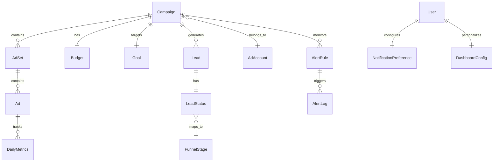

# Product Requirements Document — Marketing Hub

**Tên sản phẩm:** Marketing Hub (Internal SaaS)
**Tác giả:** Lucas
**Ngày tạo:** 2026-02-24
**Ngày cập nhật:** 2026-03-02
**Phiên bản:** 1.1
**Nguồn:** Brainstorming Session 2026-02-24 (45 ideas, 3 techniques)

---

## 1. Tổng quan sản phẩm

### 1.1 Tầm nhìn sản phẩm

Marketing Hub là giải pháp SaaS nội bộ giúp team marketing **quản lý dữ liệu đa kênh** (Facebook, Zalo, TikTok, CRM) trên một nền tảng thống nhất. Thay vì nhập tay vào Google Sheets, hệ thống **tự động đồng bộ** dữ liệu, **chuẩn hóa metrics** cross-channel, và **chủ động đẩy insight** qua Dashboard + Telegram Bot + Email.

### 1.2 Bài toán cần giải quyết

| Problem | Impact | Severity |
|---------|--------|----------|
| **Nhập liệu thủ công** từ FB/TikTok/CRM vào Google Sheets | Delay 2 ngày, tốn 2h/ngày | 🔴 Critical |
| **Công thức chuyển đổi không nhất quán** giữa các kênh | Báo cáo sai, quyết định dựa trên data không chính xác | 🔴 Critical |
| **Thiếu phân tích tự động** — CMO phải tự pivot, tự so sánh | Mất thời gian phân tích, quá tải decision-making | 🟡 High |
| **Không có cảnh báo tự động** khi chiến dịch vượt budget hoặc kém hiệu quả | Tiền quảng cáo bị đốt, phản ứng chậm | 🟡 High |
| **Dữ liệu phân tán** — mỗi kênh 1 nơi, mỗi người 1 file | Không single source of truth, conflict khi báo cáo | 🟡 High |

### 1.3 Đối tượng sử dụng

| Role | Số lượng | Nhu cầu chính |
|------|----------|---------------|
| **CMO** | 1 | Executive KPI dashboard, budget overview, ROI cross-channel |
| **Head of Marketing** | 1 | Campaign health monitoring, team performance, weekly reports |
| **Marketing Manager** | 1 | Campaign management, goal tracking, staff task assignment |
| **Marketing Staff** | 7 | Data verification, campaign input, daily operations |
| **Tổng** | **10** | |

### 1.4 Quy mô hoạt động

- **~20 chiến dịch** hoạt động mỗi tháng
- **~20 ad accounts** (Facebook, TikTok, Zalo)
- **4 nguồn dữ liệu**: Facebook Ads, TikTok Ads, Zalo OA/Ads, Pancake CRM
- **Báo cáo**: Daily (Telegram), Weekly (Email), Monthly (Dashboard)

### 1.5 Implementation Status (Updated 2026-03-02)

> **Tổng quan:** Ứng dụng đã deploy với frontend/dashboard hoạt động, nhưng backend services chủ yếu là stubs.

| Feature Area | Status | Notes |
|-------------|--------|-------|
| **Data Pipeline** | ✅ FULL | Google Sheets → CSV → PostgreSQL → API → Frontend hoạt động hoàn chỉnh |
| **CMO Dashboard** | ✅ FULL | Real data, KPIs, sparklines, channel comparison, time filters |
| **Reports Page** | ✅ FULL | Funnel visualization, company/channel filters |
| **Staff Data Entry** | ✅ FULL | DB read/write, CSV upload hoạt động |
| **Database Schema** | ✅ FULL | Prisma schema đầy đủ, bao gồm aggregated tables |
| **Redis Cache** | ✅ FULL | TTL 300s cho summary/channel APIs |
| **Role-based Nav** | ✅ FULL | CMO/HEAD/MANAGER/STAFF layout |
| **Auth** | ⚠️ PARTIAL | Login UI exists, backend trả placeholder |
| **Manager View** | ⚠️ PARTIAL | Uses mock data từ `campaigns.ts`, không có DB persistence |
| **Alerts UI** | ⚠️ PARTIAL | UI complete với demo data, không có backend evaluation |
| **FB/TikTok API** | ❌ STUB | NestJS module có TODO, chưa implement |
| **Pancake CRM** | ❌ STUB | Webhook chưa implement |
| **Telegram Bot** | ❌ STUB | grammY chưa implement |
| **Email (Resend)** | ❌ STUB | Chưa implement |
| **Backend Services** | ❌ STUB | Tất cả NestJS modules chứa TODOs |
| **Campaign CRUD** | ❌ STUB | Không có DB persistence |
| **Goal Tracking** | ❌ STUB | Schema có, không có UI/logic |

#### Deployed URLs
- **Frontend:** `https://web-16weq4n2t-thaivu-6359s-projects.vercel.app`
- **Database:** Neon PostgreSQL

#### Data Volume (as of 2026-03-02)
| Company | 2025 Rows | 2026 Rows | Total |
|---------|----------|----------|-------|
| San Dentist | 2,787 | 438 | 3,225 |
| Teennie | 279 | 341 | 620 |
| The Gioi Implant | 1,323 | 242 | 1,565 |
| **Total** | **4,389** | **1,021** | **5,410** |

---

## 2. Mục tiêu thành công

### 2.1 KPI Chính

| Metric | Hiện tại | Mục tiêu Phase 1 | Mục tiêu Phase 2 |
|--------|----------|-------------------|-------------------|
| **Thời gian nhập liệu/ngày** | 2 giờ | < 30 phút | < 10 phút |
| **Data delay** | 2 ngày | < 4 giờ | Real-time |
| **Thời gian tạo báo cáo CMO** | 1-2 giờ (thủ công) | Tự động | Tự động + AI insight |
| **Tỷ lệ phát hiện overspend** | Phát hiện sau 2 ngày | < 1 giờ | Instant (alert) |
| **Nhất quán công thức conversion** | Mỗi người 1 cách | 100% (unified) | 100% + attribution |

### 2.2 Business Outcomes

1. **Tiết kiệm ~10h/tuần** cho team (2h/ngày × 5 ngày nhập liệu thủ công)
2. **Giảm waste ad spend** — phát hiện overspend sớm hơn 2 ngày
3. **Quyết định nhanh hơn** — CMO có real-time data thay vì data cũ 2 ngày
4. **Single source of truth** — loại bỏ conflict báo cáo giữa các file cá nhân

---

## 3. User Journeys

### 3.1 Journey: Marketing Staff — Daily Operations

```
[Sáng] Login → Check task queue (chiến dịch cần verify)
       → Review auto-synced data → Verify & annotate
       → Import manual data cho Zalo (smart input form)
       → Mark tasks complete

[Chiều] Check campaign health cards
        → Flag issues cho Manager
        → Update notes/tags trên campaigns
```

**Before:** Copy data từ FB Ads Manager → Paste vào Google Sheets → Cross-check → Pivot → Báo cáo

**After:** Mở app → xem auto-synced data → verify → annotate → done

### 3.2 Journey: Marketing Manager — Campaign Management

```
[8:00 AM] Nhận morning briefing qua Telegram Bot
          "3 highlights | 2 cảnh báo | 1 đề xuất"

[9:00 AM] Login dashboard → Manager View
          → Campaign health overview (green/yellow/red cards)
          → Check budget pacing indicators
          → Review staff task completion

[Khi cần] Query Telegram: "/budget campaign-x"
          → Bot trả về mini-report ngay

[Tuần]   Review weekly report (auto-generated PDF via email)
```

### 3.3 Journey: CMO — Executive Decision Making

```
[8:00 AM] Telegram morning briefing (3 dòng)
          "Budget FB tháng này đã dùng 65%, on-pace ✅"
          "TikTok CPL tăng 35% vs tuần trước ⚠️"
          "Tổng leads tháng: 340/500 target (68%) 📊"

[Khi cần] Mở CMO Dashboard → Executive KPI View
          → ROI by channel (cross-channel comparison)
          → Budget burn rate
          → Goal progress (actual vs target)

[Alert]  Nhận push alert: "Chiến dịch X cần quyết định: tiếp tục hay pause?"
         → Tap button trả lời ngay trong Telegram
```

---

## 4. Domain Model

### 4.1 Core Entities

```
Campaign
├── id, name, status, start_date, end_date
├── channel (FB | TikTok | Zalo | CRM)
├── AdAccount (reference)
├── Budget { planned, actual_spend, pace_status, daily_limit }
├── Goal { target_leads, target_conversions, target_cpl, target_roas }
├── AdSet[]
│   └── Ad[]
│       └── DailyMetrics { date, impressions, clicks, spend, leads, conversions }
├── Lead[] (from CRM sync)
│   └── LeadStatus { stage, source_channel, conversion_event, value }
└── AlertRule[] { type, threshold, channel, recipient_role }

User
├── id, name, email, role (CMO | HEAD | MANAGER | STAFF)
├── NotificationPreference { telegram_chat_id, email, alert_types[], frequency }
└── DashboardConfig { saved_views[], widget_layout, default_view }

FunnelStage
├── stage_name (Awareness | Interest | Lead | Qualified | Conversion | Retention)
└── ChannelMapping { fb_event → stage, tiktok_event → stage, zalo_event → stage }

AlertLog
├── alert_rule_id, triggered_at, message, channel_sent, acknowledged_by
└── decision_action (pause | continue | adjust | none)
```

### 4.2 Key Relationships



---

## 5. Innovation & Differentiation

### 5.1 Goal-Driven Campaign Management

> Đảo ngược workflow truyền thống: **Set goal → Track gap → Real-time alerts** thay vì "nhập data → pivot → đánh giá"

- Manager set KPI mục tiêu: "500 leads, budget 100M, CPL < 200K"
- Hệ thống tự tính pace, dự báo, và alert khi lệch quá 30%
- Budget pacing indicator kiểu banking app: "65% budget, 12 ngày còn lại, pace: on-track ✅"

### 5.2 Bi-directional Telegram Bot

> Không chỉ push alerts — CMO/Manager **query** analytics trực tiếp trong Telegram

| Command | Response |
|---------|----------|
| `/report today` | Mini-report: spend, leads, top campaign hôm nay |
| `/compare fb tiktok` | So sánh CPL, leads, ROAS giữa 2 kênh |
| `/budget campaign-x` | Budget status + pace + forecast |
| `/alert setup` | Cấu hình alert cá nhân |

### 5.3 Unified Conversion Engine

> Một funnel chuẩn, tất cả kênh quy về cùng stages

- FB Lead Form → Stage "Lead"
- TikTok View → Landing Page → Stage "Interest"
- Zalo Message → Stage "Lead"
- CRM Qualified → Stage "Qualified"
- **Unified CPL** = Total Spend / Total Leads (normalized cross-channel)

### 5.4 Zero-Ask Reporting Culture

> Câu hỏi chưa được hỏi đã có câu trả lời

| Thời điểm | Kênh | Nội dung |
|-----------|------|----------|
| 8:00 AM daily | Telegram | Morning briefing: 3 highlights, 2 warnings, 1 suggestion |
| Monday 9:00 AM | Email PDF | Weekly report: spend, leads, ROI by channel, trend |
| Ngày 1 mỗi tháng | Dashboard | Monthly deep-dive: goal achievement, budget utilization, top campaigns |
| Real-time | Telegram | Budget alert, performance drop, anomaly detected |

---

## 6. Project Configuration

| Parameter | Value |
|-----------|-------|
| **Project type** | Greenfield (new build) |
| **Deployment** | Internal SaaS (self-hosted or cloud) |
| **Users** | 10 internal (fixed team) |
| **Scale** | 20 campaigns × 20 ad accounts |
| **Language** | Vietnamese UI, Vietnamese reports |
| **Delivery** | Progressive: Phase 1 (4w) → Phase 2 (4w) → Phase 3 (4w) |

---

## 7. Scoping & Phased Delivery

### Phase 1 — Foundation (Tuần 1–4) 🟢 *In Progress: 40%*

**Goal:** Giảm 80% nhập tay, CMO có dashboard real-time

| Feature | Priority | Effort | Status |
|---------|----------|--------|--------|
| FB Marketing API connector (auto-sync spend/clicks/leads) | P0 | M | ❌ STUB |
| TikTok Marketing API connector | P0 | M | ❌ STUB |
| CSV upload fallback (Zalo + manual data) | P0 | S | ✅ DONE |
| Pancake CRM webhook integration (real-time lead push) | P0 | M | ❌ STUB |
| PostgreSQL schema: Campaign → AdSet → Ad → Metrics → Lead | P0 | M | ✅ DONE |
| Auth + Role-based access (CMO/Manager/Staff) | P0 | S | ⚠️ PARTIAL |
| Dashboard: CMO KPI View | P0 | L | ✅ DONE |
| Dashboard: Manager Campaign Health View | P0 | L | ⚠️ MOCK DATA |
| Dashboard: Staff Task/Data Entry View | P0 | L | ✅ DONE |
| Telegram Bot v1: morning briefing + budget threshold alert | P1 | M | ❌ STUB |
| Unified CPL formula (normalized cross-channel) | P1 | S | ✅ DONE |
| Smart input forms (validation + anomaly detection) | P1 | M | ⚠️ PARTIAL |

### Phase 2 — Intelligence (Tuần 5–8) 🟡 *In Progress: 10%*

**Goal:** Chuẩn hóa conversion funnel, goal tracking, advanced alerts

| Feature | Priority | Effort | Status |
|---------|----------|--------|--------|
| Unified Funnel Mapping Engine (4 channels → 1 funnel) | P0 | L | ⚠️ SCHEMA ONLY |
| Goal Engine: set KPI → track gap → budget pacing | P0 | L | ❌ STUB |
| Multi-channel alerts: Telegram + Email, user-configurable | P0 | M | ❌ STUB |
| Telegram Bot v2: slash commands (/report, /compare, /budget) | P1 | M | ❌ STUB |
| Weekly PDF report auto-generation (email) | P1 | M | ❌ STUB |
| Data enrichment layer (staff annotate/tag on auto-sync data) | P2 | M | ❌ TODO |

### Phase 3 — Automation (Tuần 9–12) 🔴 *Not Started*

**Goal:** Proactive intelligence, zero-ask reporting

| Feature | Priority | Effort | Status |
|---------|----------|--------|--------|
| Anomaly detection (pattern-based spend alerting) | P1 | L | ❌ TODO |
| Push decision-point alerts (tìm người ra quyết định) | P1 | M | ❌ TODO |
| Campaign templates & cloning | P2 | M | ❌ TODO |
| Monthly deep-dive dashboard view | P2 | M | ❌ TODO |
| Cross-channel trend analysis | P2 | L | ❌ TODO |

### Phase 4 — Vision (Tuần 13+) 🟣 *Not Started*

| Feature | Priority | Effort | Status |
|---------|----------|--------|--------|
| AI-powered insight narrative ("chiến dịch X giảm 15% do...") | P3 | XL | ❌ TODO |
| Full cross-channel attribution scoring | P3 | XL | ❌ TODO |
| Creative intelligence (ad → content recommendations) | P3 | L | ❌ TODO |
| AI-personalized dashboard widgets | P3 | L | ❌ TODO |
| Sales forecasting from marketing data | P3 | L | ❌ TODO |

> **Effort key:** S = 1-2 ngày, M = 3-5 ngày, L = 1-2 tuần, XL = 2-4 tuần
>
> **Status key:** ✅ DONE | ⚠️ PARTIAL | ❌ STUB | ❌ TODO

---

## 8. Yêu cầu chức năng (Functional Requirements)

### 8.1 Data Ingestion Module

| ID | Requirement | Priority | Status |
|----|-------------|----------|--------|
| FR-DI-01 | Hệ thống kết nối Facebook Marketing API để tự động đồng bộ dữ liệu campaigns, ad sets, ads, và metrics (spend, impressions, clicks, conversions) | P0 | ❌ STUB |
| FR-DI-02 | Hệ thống kết nối TikTok Marketing API để đồng bộ tương tự | P0 | ❌ STUB |
| FR-DI-03 | Hệ thống hỗ trợ CSV upload cho kênh chưa có API (Zalo) với smart input forms | P0 | ✅ DONE |
| FR-DI-04 | Hệ thống nhận webhook từ Pancake CRM để đồng bộ lead real-time | P0 | ❌ STUB |
| FR-DI-05 | Data sync theo tiered refresh: FB/TikTok mỗi 4h, CRM real-time, Budget mỗi 1h | P1 | ⚠️ GHEETS SYNC |
| FR-DI-06 | Smart input forms có validation rules và anomaly detection tại thời điểm nhập | P1 | ⚠️ PARTIAL |
| FR-DI-07 | Hệ thống hiển thị trạng thái sync cho từng data source (last sync, status, errors) | P1 | ✅ DONE |

> **Note:** FR-DI-05 hiện dùng Google Sheets sync scripts thay vì FB/TikTok API. Pipeline: GSheets → CSV → PostgreSQL.

### 8.2 Campaign Management Module

| ID | Requirement | Priority | Status |
|----|-------------|----------|--------|
| FR-CM-01 | Quản lý campaigns với đầy đủ thông tin: tên, kênh, ngày bắt đầu/kết thúc, trạng thái | P0 | ⚠️ READ-ONLY |
| FR-CM-02 | Quản lý budget: planned, actual spend, daily limit, pace status | P0 | ⚠️ SCHEMA ONLY |
| FR-CM-03 | Goal setting: target leads, target conversions, target CPL, target ROAS | P0 | ⚠️ SCHEMA ONLY |
| FR-CM-04 | Goal tracking: actual vs target, progress %, pace indicator (on-track / behind / ahead) | P0 | ❌ TODO |
| FR-CM-05 | Budget pacing: dự báo ngày budget hết nếu giữ tốc độ hiện tại | P1 | ❌ TODO |
| FR-CM-06 | Campaign templates: tạo, clone, với gợi ý metrics từ lịch sử | P2 | ❌ TODO |

### 8.3 Dashboard Module

| ID | Requirement | Priority | Status |
|----|-------------|----------|--------|
| FR-DB-01 | **CMO View:** Executive KPI — total spend, total leads, overall ROI, budget utilization, cross-channel comparison | P0 | ✅ DONE |
| FR-DB-02 | **Manager View:** Campaign health cards (green/yellow/red), team task completion, budget burn rate | P0 | ⚠️ MOCK DATA |
| FR-DB-03 | **Staff View:** Task queue (campaigns cần verify), data input forms, data quality score | P0 | ✅ DONE |
| FR-DB-04 | Pre-built analytics views thay pivot: "So sánh kênh", "Budget burn", "Tuần này vs tuần trước" | P0 | ✅ DONE |
| FR-DB-05 | Visual alert: campaign cards có border status (đỏ = danger, xanh = healthy) | P1 | ⚠️ UI ONLY |
| FR-DB-06 | Date range filters: hôm nay, 7 ngày, 30 ngày, custom | P0 | ✅ DONE |
| FR-DB-07 | Saved views: mỗi user lưu views hay dùng | P2 | ❌ TODO |

### 8.4 Alert & Notification Module

| ID | Requirement | Priority | Status |
|----|-------------|----------|--------|
| FR-AL-01 | Telegram Bot gửi morning briefing 8:00 AM hằng ngày (3 highlights, 2 warnings) | P0 | ❌ STUB |
| FR-AL-02 | Budget threshold alert: notify khi spend vượt X% budget tại Y% timeline | P0 | ❌ STUB |
| FR-AL-03 | Performance drop alert: notify khi CPL tăng > 30% so với 7-day average | P1 | ❌ TODO |
| FR-AL-04 | Goal gap alert: notify khi actual < 70% projected pace | P1 | ❌ TODO |
| FR-AL-05 | Weekly report tự động qua Email (PDF) mỗi thứ 2 lúc 9:00 AM | P1 | ❌ STUB |
| FR-AL-06 | User-configurable alert routing: chọn kênh (Telegram/Email) cho từng loại alert | P1 | ⚠️ UI ONLY |
| FR-AL-07 | Telegram slash commands: /report, /compare, /budget | P1 | ❌ STUB |
| FR-AL-08 | Anomaly detection: phát hiện chi tiêu bất thường dựa trên historical pattern | P2 | ❌ TODO |

### 8.5 Unified Metrics Module

| ID | Requirement | Priority | Status |
|----|-------------|----------|--------|
| FR-UM-01 | Unified Funnel Mapping: map events từ FB/TikTok/Zalo/CRM vào funnel stages chung | P0 | ✅ DONE |
| FR-UM-02 | Normalized CPL: Cost per Lead tính thống nhất cross-channel | P0 | ✅ DONE |
| FR-UM-03 | Cross-channel comparison: so sánh hiệu quả kênh trên cùng metrics | P1 | ✅ DONE |
| FR-UM-04 | Conversion tracking: từ lead → qualified → converted với stage timestamps | P1 | ⚠️ SCHEMA ONLY |

### 8.6 User & Auth Module

| ID | Requirement | Priority | Status |
|----|-------------|----------|--------|
| FR-UA-01 | 4 roles: CMO, Head of Marketing, Manager, Staff — mỗi role có view riêng | P0 | ✅ DONE |
| FR-UA-02 | Email + password authentication | P0 | ⚠️ PARTIAL |
| FR-UA-03 | Notification preferences: mỗi user chọn kênh + tần suất alert | P1 | ❌ TODO |
| FR-UA-04 | Telegram account linking (connect chat_id với user account) | P1 | ❌ TODO |

---

## 9. Yêu cầu phi chức năng (Non-Functional Requirements)

### 9.1 Performance

| ID | Requirement | Target |
|----|-------------|--------|
| NFR-01 | Dashboard load time | < 2 giây |
| NFR-02 | API sync latency (FB/TikTok) | < 5 phút per cycle |
| NFR-03 | Telegram bot response time | < 3 giây |
| NFR-04 | Concurrent users | 10 (toàn team) |

### 9.2 Reliability

| ID | Requirement | Target |
|----|-------------|--------|
| NFR-05 | Uptime | 99.5% (internal tool) |
| NFR-06 | Data sync failure recovery | Auto-retry 3 lần, fallback CSV upload |
| NFR-07 | Alert delivery guarantee | Telegram retry, fallback email |

### 9.3 Security

| ID | Requirement | Target |
|----|-------------|--------|
| NFR-08 | Authentication | Session-based, role-enforced |
| NFR-09 | API keys storage | Environment variables, encrypted at rest |
| NFR-10 | Data access | Role-based, staff không thấy budget details |

### 9.4 Maintainability

| ID | Requirement | Target |
|----|-------------|--------|
| NFR-11 | Thêm kênh mới (Google Ads, Email Marketing) | < 1 tuần per connector |
| NFR-12 | Sửa alert rules | Manager tự cấu hình, không cần dev |
| NFR-13 | Thêm dashboard views | Config-based, không cần deploy |

### 9.5 Localization

| ID | Requirement | Target |
|----|-------------|--------|
| NFR-14 | UI language | Vietnamese |
| NFR-15 | Currency | VND |
| NFR-16 | Timezone | GMT+7 (Asia/Ho_Chi_Minh) |
| NFR-17 | Reports | Vietnamese, VND, gmt+7 timestamps |

---

## 10. Tech Stack

| Layer | Technology | Rationale |
|-------|-----------|-----------|
| **Frontend** | Next.js 15 + shadcn/ui | Server components, role-based rendering, modern UI |
| **Backend** | NestJS (Node.js) | Module architecture, cron jobs, webhook handlers |
| **Database** | PostgreSQL + Prisma ORM | Relational data, typed queries, migrations |
| **Cache** | Redis | Dashboard data cache, rate limiting, session |
| **Queue** | BullMQ (Redis-based) | Data sync jobs, report generation, alert processing |
| **Bot** | grammY (Telegram Bot API) | Slash commands, inline queries, rich formatting |
| **Email** | Resend | Template emails, PDF digest reports |
| **Auth** | Better Auth | Role-based access, session management |
| **Deploy** | Docker + VPS hoặc Vercel + Railway | Internal tool, cost-optimized |

### Architecture Diagram

```
┌─────────────────────────────────────────────┐
│            FRONTEND (Next.js)               │
│  ┌──────┐ ┌──────┐ ┌──────┐ ┌───────────┐  │
│  │CMO   │ │Mgr   │ │Staff │ │Settings   │  │
│  │View  │ │View  │ │View  │ │& Config   │  │
│  └──────┘ └──────┘ └──────┘ └───────────┘  │
├─────────────────────────────────────────────┤
│            BACKEND (NestJS)                 │
│  ┌────────┐ ┌────────┐ ┌──────┐ ┌────────┐ │
│  │DataSync│ │Campaign│ │Alert │ │Report  │ │
│  │Module  │ │Module  │ │Engine│ │Builder │ │
│  └───┬────┘ └────────┘ └──┬───┘ └────────┘ │
│      │                     │                │
│  ┌───▼────┐          ┌────▼───┐             │
│  │FB API  │          │Telegram│             │
│  │TikTok  │          │Bot     │             │
│  │Pancake │          │Email   │             │
│  │Zalo CSV│          │(Resend)│             │
│  └────────┘          └────────┘             │
├─────────────────────────────────────────────┤
│  PostgreSQL  │  Redis Cache  │  BullMQ Jobs │
└─────────────────────────────────────────────┘
```

---

## 11. Risks & Mitigations

| Risk | Probability | Impact | Mitigation |
|------|-------------|--------|------------|
| FB/TikTok API thay đổi chính sách hoặc rate limit | Medium | High | Hybrid architecture: API + CSV fallback |
| Zalo API hạn chế, thiếu analytics data | High | Medium | Adaptive connector: smart CSV upload forms |
| Data quality giảm khi chuyển từ manual → auto | Medium | Medium | Data enrichment layer: auto sync + human annotate |
| Team phản kháng thay đổi workflow | Low | Medium | Progressive delivery: ship giá trị nhỏ mỗi 2 tuần |
| Pancake CRM webhook không ổn định | Medium | High | Webhook retry + scheduled batch fallback |

---

## 12. Acceptance Criteria

### Phase 1 Definition of Done

| Criteria | Status | Notes |
|----------|--------|-------|
| FB/TikTok data tự động sync (không cần nhập tay) | ❌ | NestJS stub, chưa implement API connectors |
| Staff nhập liệu < 30 phút/ngày (Zalo + manual data) | ✅ | CSV upload + smart forms hoạt động |
| CMO mở dashboard thấy KPI executive view (spend, leads, ROI) | ✅ | Real data từ MarketingEntry/aggregated tables |
| Manager thấy campaign health view (green/yellow/red cards) | ⚠️ | UI exists nhưng dùng mock data |
| Telegram bot gửi morning briefing 8:00 AM mỗi ngày | ❌ | grammY stub, chưa implement |
| Budget threshold alert hoạt động (vượt budget → Telegram notify) | ❌ | Alert evaluation chưa implement |
| Unified CPL formula tính đúng cross-channel | ✅ | Computed in CMO/Reports pages |
| 3 roles hoạt động đúng (CMO/Manager/Staff access control) | ⚠️ | Nav hoạt động, nhưng auth backend là stub |

**Phase 1 Progress: ~40%** (3.5/8 criteria fully met)

### Phase 2 Definition of Done

| Criteria | Status | Notes |
|----------|--------|-------|
| Unified funnel mapping hoạt động cho 4 kênh | ⚠️ | Schema có, Reports page visualize funnel từ data |
| Goal setting + tracking + pacing indicator | ❌ | Schema có, không có UI/logic |
| Telegram slash commands (/report, /compare, /budget) | ❌ | grammY stub |
| Weekly PDF report tự gửi email mỗi thứ 2 | ❌ | Resend stub |
| User tự cấu hình alert routing (Telegram vs Email) | ❌ | UI demo only |

**Phase 2 Progress: ~10%** (0.5/5 criteria partially met)

### Key Gaps to Address

1. **Auth Backend** — Cần implement Better Auth hoặc custom solution
2. **Manager Campaign Persistence** — Cần kết nối UI với DB thay vì mock data
3. **Backend Services** — Cần implement actual logic trong NestJS modules
4. **FB/TikTok Connectors** — Cần implement API sync (hoặc dùng Google Sheets làm nguồn chính)
5. **Telegram Bot** — Cần implement grammY với slash commands
6. **Alert Engine** — Cần implement evaluation + dispatch logic

---

## Appendix: Brainstorming Source

Tài liệu này được tạo tự động từ phiên brainstorming BMAD ngày 2026-02-24 với kết quả:

- **45 ý tưởng** qua 3 kỹ thuật: Six Thinking Hats, SCAMPER, Morphological Analysis
- **7 chủ đề chính**: Data Ingestion, Dashboard, Unified Metrics, Alert System, Goal-driven Management, UX/Workflow, Architecture
- **Top 5 breakthroughs**: Unified Funnel Mapping, Goal-driven Campaign Mgmt, Bi-directional Telegram Bot, Progressive Delivery, Zero Manual Entry

Source file: `_bmad-output/brainstorming/brainstorming-session-2026-02-24.md`

---

## Appendix: Implementation Summary (2026-03-02)

### Overall Progress

| Phase | Progress | Status |
|-------|----------|--------|
| Phase 1 — Foundation | **40%** | 🟡 In Progress |
| Phase 2 — Intelligence | **10%** | 🔴 Blocked |
| Phase 3 — Automation | **0%** | ⚪ Not Started |
| Phase 4 — Vision | **0%** | ⚪ Not Started |

### Functional Requirements Summary

| Module | Total | Done | Partial | Not Done |
|--------|-------|------|---------|----------|
| Data Ingestion | 7 | 2 | 2 | 3 |
| Campaign Management | 6 | 0 | 2 | 4 |
| Dashboard | 7 | 4 | 2 | 1 |
| Alert & Notification | 8 | 0 | 1 | 7 |
| Unified Metrics | 4 | 3 | 1 | 0 |
| User & Auth | 4 | 1 | 1 | 2 |
| **Total** | **36** | **10** | **9** | **17** |

**Completion Rate: 28% (10/36)**

### Key Accomplishments

1. ✅ **Google Sheets Data Pipeline** — Complete flow from GSheets → CSV → PostgreSQL → API → Frontend
2. ✅ **CMO Dashboard** — Executive KPIs, channel comparison, time filtering
3. ✅ **Reports Page** — Funnel visualization with company/channel breakdown
4. ✅ **Staff Data Entry** — Real DB persistence, CSV upload
5. ✅ **Role-based Navigation** — CMO/HEAD/MANAGER/STAFF layouts

### Critical Blockers

1. 🔴 **Backend Services** — All NestJS modules are stubs with TODOs
2. 🔴 **Auth Implementation** — Login UI exists but backend returns placeholders
3. 🔴 **FB/TikTok Connectors** — Not implemented, currently using Google Sheets as data source
4. 🔴 **Telegram Bot** — grammY stub, no implementation
5. 🔴 **Email Service** — Resend stub, no implementation

### Recommended Next Steps

1. **Implement Auth Backend** — Better Auth integration for real session management
2. **Connect Manager View to DB** — Replace mock data with real MarketingEntry queries
3. **Implement FB/TikTok Connectors OR formalize Google Sheets as primary source**
4. **Implement Telegram Bot** — grammY with basic slash commands
5. **Implement Alert Engine** — Evaluation + dispatch logic

### Architecture Reality vs Plan

| Planned | Actual |
|---------|--------|
| FB/TikTok API → NestJS | Google Sheets → Scripts → PostgreSQL |
| NestJS Backend (full) | NestJS stubs, Next.js API routes do real work |
| Better Auth | Placeholder auth |
| grammY Bot | Stub |
| Resend Email | Stub |
| BullMQ Jobs | Not used (scripts run manually or via GitHub Actions) |

**Current Data Flow:**
```
Google Sheets → sync-from-sheet.mjs → CSV files
CSV files → import-new-data.mjs → PostgreSQL (MarketingEntry)
PostgreSQL → Next.js API routes → Frontend (with Redis cache)
```
